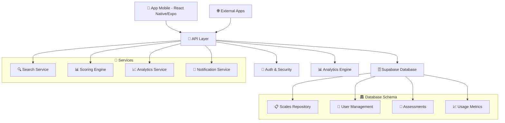

# 🏥 Repositorio de Escalas Médicas - DeepLuxMed

> **Una plataforma integral para gestionar, buscar y utilizar escalas de evaluación médica con API robusta para integración externa.**

[](https://github.com/deepluxmed/escalas-dlm-api)
[](https://creativecommons.org/licenses/by-nc/4.0/)
[](https://reactnative.dev/)
[](https://expo.dev/)
[](https://supabase.com/)

---

## 📋 Tabla de Contenidos

- [🎯 Descripción](#-descripción)
- [✨ Características](#-características)
- [🏗️ Arquitectura](#️-arquitectura)
- [🚀 Instalación](#-instalación)
- [📊 Base de Datos](#-base-de-datos)
- [🔧 Configuración](#-configuración)
- [📖 API Documentation](#-api-documentation)
- [🧪 Escalas Disponibles](#-escalas-disponibles)
- [💻 Uso](#-uso)
- [🔐 Seguridad](#-seguridad)
- [🤝 Contribuir](#-contribuir)
- [📈 Roadmap](#-roadmap)

---

## 🎯 Descripción

Este proyecto es un **repositorio integral de escalas médicas** que permite:

- **🔍 Búsqueda avanzada** de escalas por categoría, especialidad, tags y texto libre
- **📊 Gestión completa** de escalas con preguntas, opciones y scoring automatizado
- **🧮 Evaluaciones clínicas** con cálculo automático de puntuaciones e interpretaciones
- **📱 Aplicación móvil** nativa para iOS y Android
- **🌐 API REST robusta** para integración con otras aplicaciones médicas
- **📈 Analytics** de uso y métricas de escalas
- **🔐 Seguridad HIPAA** compliant para datos médicos

### 🎯 Casos de Uso

1. **Clínicos**: Acceso rápido a escalas validadas durante consultas
2. **Investigadores**: Repositorio centralizado de herramientas de evaluación
3. **Desarrolladores**: API para integrar escalas en aplicaciones médicas
4. **Instituciones**: Standardización de herramientas de evaluación

---

## ✨ Características

### 🔍 **Búsqueda y Filtrado Avanzado**
- Búsqueda de texto completo en PostgreSQL
- Filtros por categoría, especialidad y sistema corporal
- Filtrado por tags y popularidad
- Soporte multiidioma (ES/EN)
- Paginación y ordenamiento flexible

### 📊 **Gestión Completa de Escalas**
- Definición estructurada de escalas médicas
- Preguntas con múltiples tipos de respuesta
- Sistema de scoring configurable (suma, promedio, ponderado, complejo)
- Rangos de interpretación con recomendaciones
- Referencias bibliográficas y evidencia científica
- Control de versiones y actualizaciones

### 🧮 **Evaluaciones Clínicas**
- Creación y almacenamiento de evaluaciones
- Cálculo automático de puntuaciones
- Interpretación basada en rangos validados
- Asociación con pacientes (con controles de privacidad)
- Tracking de sesiones y dispositivos para analytics

### 📈 **Analytics y Métricas**
- Métricas de uso por escala
- Estadísticas de completado
- Análisis de popularidad
- Insights de engagement de usuarios
- Monitoreo de rendimiento

### 🔐 **Seguridad y Compliance**
- Cumplimiento HIPAA para datos médicos
- Control de acceso basado en roles
- Logging de auditoría para todas las operaciones
- Autenticación y autorización segura
- Cifrado de datos en reposo y tránsito

### 🌐 **API REST Robusta**
- Endpoints públicos y autenticados
- Documentación OpenAPI/Swagger
- Rate limiting configurable
- Respuestas consistentes con manejo de errores
- Soporte para integraciones externas

---

## 🏗️ Arquitectura



### **Stack Tecnológico**

| Componente | Tecnología | Versión |
|------------|------------|---------|
| **Frontend** | React Native + Expo | 0.76.6 / 52.0.33 |
| **Backend** | Supabase (PostgreSQL) | Latest |
| **Authentication** | Supabase Auth | Latest |
| **State Management** | Zustand + React Query | 4.5.0 / 5.17.19 |
| **Database** | PostgreSQL con RLS | 15+ |
| **Storage** | Supabase Storage | Latest |
| **Analytics** | Custom + Supabase Analytics | - |
| **Type Safety** | TypeScript | 5.3.3 |

---

## 🚀 Instalación

### **Prerrequisitos**

- Node.js 18+ y npm/yarn
- Expo CLI (`npm install -g @expo/cli`)
- Cuenta de Supabase
- Git

### **1. Clonar el Repositorio**

```bash
git clone https://github.com/deepluxmed/escalas-dlm-api.git
cd escalas-dlm-api
```

### **2. Instalar Dependencias**

```bash
npm install
# o
yarn install
```

### **3. Configurar Variables de Entorno**

Crear archivo `.env.local`:

```env
# Supabase Configuration
EXPO_PUBLIC_SUPABASE_URL=https://tu-proyecto.supabase.co
EXPO_PUBLIC_SUPABASE_ANON_KEY=tu-anon-key
SUPABASE_SERVICE_ROLE_KEY=tu-service-role-key

# App Configuration
EXPO_PUBLIC_APP_NAME="Escalas Médicas DLM"
EXPO_PUBLIC_APP_VERSION="2.0.0"
EXPO_PUBLIC_API_URL="/api"

# Analytics (opcional)
EXPO_PUBLIC_ANALYTICS_ENABLED=true
```

### **4. Configurar Base de Datos**

```bash
# Ejecutar schema SQL en Supabase
# Copiar y ejecutar el contenido de database/schema.sql en el SQL Editor de Supabase
```

### **5. Migrar Datos Iniciales**

```bash
# Ejecutar migración de escalas existentes
npx ts-node -r tsconfig-paths/register api/utils/migrateScales.ts
```

### **6. Ejecutar Aplicación**

```bash
# Desarrollo
npm run dev

# Build para producción
npm run build:web
```

---

## 📊 Base de Datos

### **Esquema Principal**

```sql
-- Escalas médicas principales
medical_scales
├── id (UUID, PK)
├── name (VARCHAR, NOT NULL)
├── acronym (VARCHAR)
├── description (TEXT, NOT NULL)
├── category (VARCHAR, NOT NULL)
├── specialty (VARCHAR)
├── body_system (VARCHAR)
├── tags (TEXT[])
├── popularity (INTEGER)
├── status (VARCHAR) -- active, draft, deprecated
└── ... metadatos adicionales

-- Preguntas de las escalas
scale_questions
├── id (UUID, PK)
├── scale_id (UUID, FK)
├── question_text (TEXT, NOT NULL)
├── question_type (VARCHAR) -- single_choice, multiple_choice, etc.
├── order_index (INTEGER)
└── ... configuración adicional

-- Opciones de respuesta
question_options
├── id (UUID, PK)
├── question_id (UUID, FK)
├── option_value (NUMERIC, NOT NULL)
├── option_label (TEXT, NOT NULL)
├── order_index (INTEGER)
└── ... configuración adicional

-- Sistema de scoring
scale_scoring + scoring_ranges
-- Referencias bibliográficas
scale_references
-- Traducciones multiidioma
scale_translations
-- Evaluaciones realizadas
scale_assessments
-- Métricas de uso
scale_usage_metrics
```

### **Relaciones**

- **1:N** - Una escala tiene múltiples preguntas
- **1:N** - Una pregunta tiene múltiples opciones
- **1:1** - Una escala tiene un sistema de scoring
- **1:N** - Un scoring tiene múltiples rangos de interpretación
- **1:N** - Una escala tiene múltiples referencias
- **N:N** - Usuarios pueden tener escalas favoritas

---

## 🔧 Configuración

### **Configuración de Supabase**

1. **Crear proyecto** en [Supabase](https://supabase.com)

2. **Ejecutar schema** desde `database/schema.sql`

3. **Configurar RLS** (Row Level Security):
   - Políticas públicas para lectura de escalas activas
   - Políticas autenticadas para evaluaciones
   - Políticas admin para gestión de escalas

4. **Configurar Storage** (opcional):
   - Bucket para imágenes de escalas
   - Políticas de acceso público para assets

### **Configuración de Authentication**

```javascript
// Configuración en Supabase Dashboard
{
  "site_url": "https://tu-dominio.com",
  "additional_redirect_urls": [
    "exp://127.0.0.1:19000",
    "https://tu-app.vercel.app"
  ],
  "jwt_expiry": 3600,
  "enable_signup": true,
  "email_confirm": true
}
```

---

## 📖 API Documentation

### **Endpoints Públicos** (Sin autenticación)

#### **GET /api/scales** - Buscar escalas
```typescript
// Parámetros
interface GetScalesParams {
  query?: string;          // Búsqueda de texto
  category?: string;       // Filtro por categoría
  specialty?: string;      // Filtro por especialidad
  tags?: string[];         // Filtro por tags
  language?: 'es' | 'en';  // Idioma
  limit?: number;          // Resultados por página (máx 100)
  page?: number;           // Número de página
  sortBy?: 'name' | 'popularity' | 'created_at';
  sortOrder?: 'asc' | 'desc';
}

// Respuesta
interface ScalesResponse {
  data: Scale[];
  count: number;
  error: boolean;
  pagination: {
    page: number;
    limit: number;
    totalPages: number;
    totalItems: number;
  };
}
```

#### **GET /api/scales/:id** - Detalles de escala
```typescript
// Parámetros
{
  id: string;              // ID de la escala
  language?: 'es' | 'en';  // Idioma para traducciones
}

// Respuesta
interface ScaleResponse {
  data: ScaleWithDetails;  // Escala completa con preguntas, scoring, etc.
  error: boolean;
}
```

#### **GET /api/scales/categories** - Categorías disponibles
```typescript
// Respuesta
{
  data: Array<{ category: string; count: number }>;
  error: boolean;
}
```

#### **GET /api/scales/popular** - Escalas populares
```typescript
// Parámetros
{ limit?: number }

// Respuesta
ScalesResponse
```

### **Endpoints Autenticados** (Requieren login)

#### **POST /api/assessments** - Crear evaluación
```typescript
// Body
interface AssessmentRequest {
  scale_id: string;
  patient_id?: string;
  responses: Record<string, number | string>;
  session_id?: string;
  device_info?: object;
}

// Respuesta
interface AssessmentResponse {
  data: {
    id: string;
    total_score: number;
    interpretation: string;
    completed_at: string;
  };
  error: boolean;
}
```

#### **POST /api/favorites/:scale_id** - Agregar a favoritos
#### **DELETE /api/favorites/:scale_id** - Quitar de favoritos
#### **GET /api/favorites** - Obtener favoritos del usuario

### **Endpoints Admin** (Requieren rol admin/practitioner)

#### **POST /api/scales** - Crear nueva escala
#### **PUT /api/scales/:id** - Actualizar escala
#### **DELETE /api/scales/:id** - Eliminar escala
#### **GET /api/scales/:id/statistics** - Estadísticas de escala

### **Ejemplos de Uso**

```typescript
import { getScales, getScaleById, createScaleAssessment } from '@/api';

// Buscar escalas funcionales
const functionalScales = await getScales({
  category: 'Funcional',
  tags: ['rehabilitación'],
  limit: 10,
  sortBy: 'popularity'
});

// Obtener detalles del Índice de Barthel
const barthel = await getScaleById('barthel-uuid');

// Crear evaluación
const assessment = await createScaleAssessment({
  scale_id: 'barthel-uuid',
  responses: {
    'comida': 10,
    'lavado': 5,
    'vestido': 10,
    // ... más respuestas
  }
});

console.log(`Puntuación total: ${assessment.data?.total_score}`);
console.log(`Interpretación: ${assessment.data?.interpretation}`);
```

---

## 🧪 Escalas Disponibles

### **Escalas Incluidas Inicialmente**

| Escala | Categoría | Especialidad | Preguntas | Descripción |
|--------|-----------|--------------|-----------|-------------|
| **Índice de Barthel** | Funcional | Medicina Física y Rehabilitación | 10 | Evaluación de actividades básicas de la vida diaria |
| **Cuestionario de Boston** | Neurológica | Neurología | 19 | Evaluación del síndrome del túnel carpiano |

### **Categorías Disponibles**

- **Funcional**: Escalas de independencia y actividades de la vida diaria
- **Neurológica**: Evaluaciones neurológicas y cognitivas
- **Psiquiátrica**: Escalas de salud mental y psiquiatría
- **Cardiovascular**: Evaluaciones cardíacas y riesgo cardiovascular
- **Respiratoria**: Función pulmonar y respiratoria
- **Dolor**: Escalas de evaluación del dolor
- **Calidad de Vida**: Medidas de calidad de vida relacionada con la salud
- **Cognitiva**: Evaluaciones de función cognitiva
- **Geriátrica**: Escalas específicas para adultos mayores
- **Pediátrica**: Evaluaciones para población pediátrica
- **Rehabilitación**: Escalas de proceso de rehabilitación
- **Oncológica**: Evaluaciones en pacientes oncológicos

### **Especialidades Médicas Cubiertas**

- Medicina Física y Rehabilitación
- Neurología
- Psiquiatría
- Cardiología
- Neumología
- Geriatría
- Pediatría
- Oncología
- Medicina Interna
- Medicina Familiar
- Terapia Ocupacional
- Fisioterapia
- Psicología Clínica

---

## 💻 Uso

### **Para Desarrolladores**

#### **Integración con la API**

```typescript
// Instalación
npm install @deepluxmed/medical-scales-api

// Configuración
import { MedicalScalesAPI } from '@deepluxmed/medical-scales-api';

const api = new MedicalScalesAPI({
  baseURL: 'https://escalas-api.deepluxmed.com',
  apiKey: 'tu-api-key' // Para endpoints autenticados
});

// Buscar escalas
const scales = await api.getScales({
  category: 'Neurológica',
  language: 'es'
});

// Obtener escala específica
const scale = await api.getScale('escala-id');

// Crear evaluación
const assessment = await api.createAssessment({
  scaleId: 'escala-id',
  responses: { ... },
  patientId: 'paciente-id'
});
```

#### **Agregar Nuevas Escalas**

```typescript
import { generateScaleTemplate, importScale } from '@/api/utils/scaleImporter';

// Generar plantilla
const template = generateScaleTemplate();

// Personalizar escala
const newScale = {
  ...template,
  name: 'Mi Nueva Escala',
  description: 'Evaluación para...',
  category: 'Funcional',
  questions: [
    {
      question_id: 'pregunta_1',
      question_text: '¿Pregunta 1?',
      options: [
        { option_value: 0, option_label: 'No', order_index: 1 },
        { option_value: 1, option_label: 'Sí', order_index: 2 }
      ]
    }
  ]
};

// Importar a la base de datos
const result = await importScale(newScale);
```

### **Para Clínicos**

#### **Usando la App Móvil**

1. **Buscar escalas** por categoría o término de búsqueda
2. **Seleccionar escala** apropiada para el paciente
3. **Completar evaluación** siguiendo las instrucciones
4. **Obtener resultados** automáticos con interpretación
5. **Guardar** en historial del paciente (si está autenticado)

#### **Flujo de Evaluación Típico**

```
📱 Abrir App
   ↓
🔍 Buscar "Barthel" o navegar por Funcional
   ↓
📋 Seleccionar "Índice de Barthel"
   ↓
📖 Revisar instrucciones y descripción
   ↓
✅ Completar 10 preguntas sobre AVD
   ↓
📊 Obtener puntuación total (0-100)
   ↓
📋 Revisar interpretación y recomendaciones
   ↓
💾 Guardar en perfil de paciente (opcional)
```

---

## 🔐 Seguridad

### **Cumplimiento HIPAA**

- **Cifrado**: Todos los datos están cifrados en reposo y en tránsito
- **Acceso controlado**: Sistema de roles y permisos granular
- **Auditoría**: Logging completo de todas las operaciones
- **Anonimización**: Datos de pacientes pueden ser anonimizados
- **Retención**: Políticas de retención de datos configurables

### **Autenticación y Autorización**

```typescript
// Roles disponibles
enum UserRole {
  PATIENT = 'patient',        // Acceso básico a escalas
  PRACTITIONER = 'practitioner', // Acceso completo + creación evaluaciones
  ADMIN = 'admin'             // Acceso total + gestión de escalas
}

// Permisos por rol
const permissions = {
  patient: ['read_scales', 'read_own_data'],
  practitioner: ['read_scales', 'create_assessment', 'read_patient_data'],
  admin: ['all_permissions']
};
```

### **Row Level Security (RLS)**

```sql
-- Política de ejemplo: usuarios solo ven sus evaluaciones
CREATE POLICY "Users can read their own assessments" 
  ON scale_assessments FOR SELECT 
  TO authenticated 
  USING (user_id = auth.uid());

-- Política: escalas activas son públicas
CREATE POLICY "Public read access for active scales" 
  ON medical_scales FOR SELECT 
  USING (status = 'active');
```

---

## 🤝 Contribuir

### **Proceso de Contribución**

1. **Fork** del repositorio
2. **Crear branch** para nueva feature (`git checkout -b feature/nueva-escala`)
3. **Implementar** cambios siguiendo las convenciones
4. **Tests** - Asegurar que todos los tests pasan
5. **Documentar** - Actualizar documentación si es necesario
6. **Pull Request** - Crear PR con descripción detallada

### **Convenciones de Código**

- **TypeScript** estricto con tipos explícitos
- **ESLint + Prettier** para formato consistente
- **Conventional Commits** para mensajes de commit
- **Tests** unitarios para nuevas funciones
- **Documentación** JSDoc para funciones públicas

### **Agregar Nuevas Escalas**

```typescript
// 1. Crear definición de escala
const newScale = {
  name: 'Escala de Nueva Evaluación',
  category: 'Neurológica',
  questions: [...],
  scoring: {...},
  references: [...]
};

// 2. Validar estructura
const validation = validateScaleData(newScale);
if (!validation.isValid) {
  console.error('Errores:', validation.errors);
  return;
}

// 3. Importar a base de datos
const result = await importScale(newScale);

// 4. Crear tests
describe('Nueva Escala', () => {
  test('debe calcular puntuación correctamente', () => {
    // test implementation
  });
});
```

### **Guidelines para Escalas**

1. **Validación científica**: Solo escalas validadas científicamente
2. **Referencias completas**: Incluir al menos la referencia original
3. **Metadatos completos**: Categoría, especialidad, tags descriptivos
4. **Instrucciones claras**: Instrucciones de administración detalladas
5. **Interpretación estándar**: Rangos e interpretaciones basados en evidencia

---

## 📈 Roadmap

### **Versión 2.1.0** (Q2 2024)
- [ ] **50+ escalas adicionales** validadas científicamente
- [ ] **API GraphQL** para queries más eficientes
- [ ] **Dashboard web** para administradores
- [ ] **Exportación PDF** mejorada con plantillas personalizables
- [ ] **Notificaciones push** para recordatorios de evaluación

### **Versión 2.2.0** (Q3 2024)
- [ ] **Machine Learning** para recomendaciones de escalas
- [ ] **Integración HL7 FHIR** para interoperabilidad
- [ ] **App web progresiva** (PWA)
- [ ] **APIs de terceros** para importación automática de escalas
- [ ] **Marketplace de escalas** comunitario

### **Versión 3.0.0** (Q4 2024)
- [ ] **Inteligencia Artificial** para interpretación avanzada
- [ ] **Telemedicina** integrada con videoconferencia
- [ ] **Blockchain** para verificación de credenciales
- [ ] **IoT** integración con dispositivos médicos
- [ ] **Multi-tenant** arquitectura para instituciones

### **Features Solicitadas**
- [ ] Soporte para escalas pediátricas específicas
- [ ] Calculadoras médicas integradas
- [ ] Comparación longitudinal de evaluaciones
- [ ] Alertas automáticas basadas en puntuaciones
- [ ] Integración con EMR/EHR existentes

---

## 📞 Soporte y Contacto

### **Documentación**
- 📖 [API Docs](https://docs.escalas.deepluxmed.com)
- 🎥 [Video Tutoriales](https://youtube.com/deepluxmed)
- 📋 [Examples Repository](https://github.com/deepluxmed/scales-examples)

### **Soporte Técnico**
- 💬 [Discord Community](https://discord.gg/deepluxmed)
- 📧 Email: [soporte@deepluxmed.com](mailto:soporte@deepluxmed.com)
- 🐛 [Issues en GitHub](https://github.com/deepluxmed/escalas-dlm-api/issues)

### **Colaboración Científica**
- 🏥 Hospitales y clínicas interesadas en colaborar
- 🎓 Investigadores con escalas validadas para agregar
- 📊 Instituciones con necesidades específicas de evaluación

---

## 📄 Licencia

Este proyecto está licenciado bajo **Creative Commons Attribution-NonCommercial 4.0 International** (CC BY-NC 4.0).

### **Permisos**
- ✅ **Compartir** - Copiar y redistribuir en cualquier medio o formato
- ✅ **Adaptar** - Remix, transformar y construir sobre el material
- ✅ **Uso académico** - Libre para investigación y educación

### **Limitaciones**
- ❌ **Uso comercial** - No para propósitos comerciales sin permiso
- ⚠️ **Atribución** - Debe dar crédito apropiado
- ⚠️ **Responsabilidad médica** - No substituye el juicio clínico profesional

### **Uso Comercial**
Para licencias comerciales, contactar: [licencias@deepluxmed.com](mailto:licencias@deepluxmed.com)

---

## 🏆 Reconocimientos

### **Equipo de Desarrollo**
- 👨‍💻 **DeepLuxMed Team** - Desarrollo y arquitectura
- 🏥 **Colaboradores médicos** - Validación clínica
- 🧪 **Investigadores** - Aporte de escalas y referencias

### **Tecnologías y Servicios**
- 🛠️ **Supabase** - Backend as a Service
- ⚛️ **React Native/Expo** - Framework móvil
- 🗄️ **PostgreSQL** - Base de datos
- 🔧 **Vercel** - Hosting y deployment
- 📊 **Sentry** - Monitoreo de errores

### **Fuentes de Escalas**
- 📚 Literatura médica peer-reviewed
- 🏥 Protocolos hospitalarios validados
- 🌐 Organizaciones médicas internacionales
- 🔬 Investigación colaborativa

---

*Desarrollado con ❤️ para la comunidad médica por **DeepLuxMed***

[](https://reactnative.dev/)
[](https://supabase.com/)
[](#)
