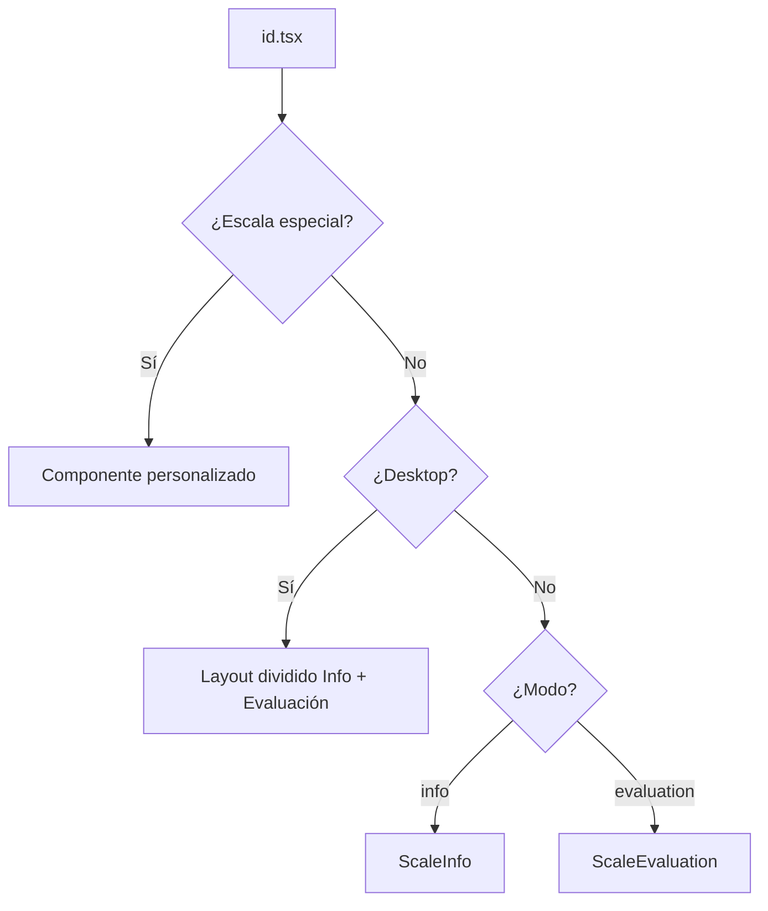

# Arquitectura del Sistema de Escalas Médicas

## Tabla de Contenidos
1. [Visión General](#visión-general)
2. [Estructura de Directorios](#estructura-de-directorios)
3. [Flujo de Datos](#flujo-de-datos)
4. [Tipos de Escalas](#tipos-de-escalas)
5. [Sistema de Adaptación](#sistema-de-adaptación)
6. [Componentes Clave](#componentes-clave)

---

## Visión General

El sistema de escalas médicas está diseñado para ser **modular y extensible**. Permite dos tipos principales de implementación:

1. **Escalas Estándar**: Basadas en preguntas con opciones de respuesta (Barthel, Boston, Berg, Katz, OGS, HINE, etc.)
2. **Escalas Personalizadas**: Con interfaces especializadas (Denver II, Calculadora de Toxina Botulínica)

### Principios de Diseño

- **Separación de Datos y Lógica**: Los datos de las escalas están en `/data`, la lógica de presentación en `/components` y `/app`
- **Adaptación Automática**: Las escalas con estructura estándar se adaptan automáticamente al formato interno
- **Type Safety**: Uso extensivo de TypeScript para prevenir errores en tiempo de compilación
- **Búsqueda Flexible**: Sistema de búsqueda que soporta múltiples términos alternativos

---

## Estructura de Directorios

```
Escalas-DLM-API-4/
├── data/                          # Definiciones de escalas
│   ├── _scales.ts                 # ⭐ Registro central y adaptadores
│   ├── barthel.ts                 # Escala individual
│   ├── berg.ts
│   ├── boston.ts
│   ├── katz.ts
│   ├── ogs.ts
│   └── ...
├── app/(tabs)/scales/             # Pantallas de evaluación
│   ├── [id].tsx                   # ⭐ Pantalla dinámica para escalas estándar
│   ├── berg.tsx                   # Pantalla personalizada (si aplica)
│   ├── denver2.tsx                # Pantalla personalizada obligatoria
│   └── ...
├── components/
│   ├── ScaleEvaluation.tsx        # ⭐ Componente genérico de evaluación
│   ├── ScaleInfo.tsx              # Muestra información de la escala
│   └── ...
├── hooks/
│   ├── useScaleDetails.ts         # Hook para cargar datos de escala
│   └── ...
├── types/
│   └── scale.ts                   # Tipos base de escala
├── api/scales/
│   └── types.ts                   # ⭐ Tipos detallados (ScaleWithDetails)
└── docs/
    ├── ARCHITECTURE.md            # Este archivo
    ├── ADDING_SCALES.md           # Guía para agregar escalas
    └── TROUBLESHOOTING.md         # Solución de errores comunes
```

### Archivos Críticos (⭐)

1. **`data/_scales.ts`**: Registry central. TODA nueva escala debe registrarse aquí
2. **`app/(tabs)/scales/[id].tsx`**: Router dinámico que decide qué componente usar
3. **`components/ScaleEvaluation.tsx`**: Motor de evaluación genérico
4. **`api/scales/types.ts`**: Contiene `ScaleWithDetails`, el formato interno estándar

---

## Flujo de Datos

### 1. Carga de Escala

```
Usuario selecciona escala
    ↓
[id].tsx recibe el parámetro 'id'
    ↓
useScaleDetails(id) busca en scalesById
    ↓
Retorna Scale | ScaleWithDetails
    ↓
[id].tsx decide qué componente renderizar
```

### 2. Renderizado



### 3. Evaluación

```
ScaleEvaluation recibe scale: ScaleWithDetails
    ↓
Itera sobre scale.questions[]
    ↓
Renderiza opciones según question_type
    ↓
Usuario selecciona respuestas
    ↓
Calcula score según scale.scoring.scoring_method
    ↓
Busca interpretación en scale.scoring.ranges[]
    ↓
Retorna resultados
```

---

## Tipos de Escalas

### A. Escalas Estándar (Uso de ScaleEvaluation)

**Características:**
- Array de preguntas con opciones de respuesta
- Sistema de puntuación predefinido (sum, average, weighted)
- Rangos de interpretación

**Ejemplos:**
- Índice de Barthel
- Cuestionario de Boston
- Escala de Berg
- Índice de Katz
- OGS (Observational Gait Scale)
- HINE

**Estructura de Datos:**

```typescript
{
  id: 'katz',
  name: 'Índice de Katz',
  questions: [
    {
      id: 'bathing',
      question: 'Baño',
      description: '...',
      options: [
        { value: 1, label: 'Independiente', description: '...' },
        { value: 0, label: 'Dependiente', description: '...' }
      ]
    }
  ],
  scoring: {
    method: 'sum',
    min: 0,
    max: 6
  },
  scoreInterpretation: [...]
}
```

### B. Escalas Personalizadas (Componente Propio)

**Características:**
- Interfaz de usuario especializada
- Lógica de evaluación compleja
- No compatible con ScaleEvaluation genérico

**Ejemplos:**
- Denver II (evaluación del desarrollo infantil con gráficas)
- Calculadora de Toxina Botulínica (múltiples tablas, cálculos de dosis)
- Test de Marcha de 6 Minutos (formulario multi-sección con mediciones vitales)

**Implementación:**
1. Crear componente en `app/(tabs)/scales/[nombre].tsx`
2. Registrar en `[id].tsx` con un `if (id === 'nombre')`
3. Crear entrada básica en `data/_scales.ts` para búsqueda

---

## Sistema de Adaptación

### Problema

`ScaleEvaluation` espera un objeto tipo `ScaleWithDetails`, que es más detallado que las definiciones simples en `/data`.

### Solución

**Funciones adaptadoras en `data/_scales.ts`**

Cada escala tiene una función `build[Nombre]Detailed()` que convierte:

```typescript
// ANTES: Estructura simple
{
  questions: [
    { id: 'q1', question: 'Pregunta', options: [...] }
  ]
}

// DESPUÉS: Estructura ScaleWithDetails
{
  questions: [
    {
      id: 'q_1',
      scale_id: 'katz',
      question_id: 'q1',
      question_text: 'Pregunta',
      question_type: 'single_choice',
      order_index: 1,
      options: [
        {
          id: 'q1_opt_1',
          question_id: 'q1',
          option_value: 1,
          option_label: 'Opción 1',
          order_index: 1,
          ...
        }
      ],
      ...
    }
  ],
  scoring: { ... },
  references: [ ... ],
  ...
}
```

### Patrón de Adaptación

```typescript
// 1. Importar datos originales
import { katzScale, questions as katzQuestions, scoreInterpretation as katzScoreInterp } from './katz';

// 2. Crear función adaptadora
const buildKatzDetailed = (): ScaleWithDetails => {
  const now = new Date().toISOString();
  const scaleId = 'katz';

  // Adaptar preguntas
  let order = 0;
  const questions: ScaleQuestion[] = katzQuestions.map((q) => {
    const questionId = q.id;
    const opts: QuestionOption[] = q.options.map((opt, idx) => ({
      id: `${questionId}_opt_${idx+1}`,
      question_id: questionId,
      option_value: Number(opt.value),
      option_label: String(opt.label),
      option_description: opt.description,
      order_index: idx + 1,
      is_default: false,
      created_at: now,
    }));

    order += 1;
    return {
      id: `q_${order}`,
      scale_id: scaleId,
      question_id: questionId,
      question_text: String(q.question),
      description: q.description,
      question_type: 'single_choice',
      order_index: order,
      is_required: true,
      category: q.category,
      options: opts,
      created_at: now,
      updated_at: now,
    };
  });

  // Adaptar rangos de interpretación
  const ranges: ScoringRange[] = katzScoreInterp.map((r, idx) => ({
    id: `r_katz_${idx+1}`,
    scoring_id: 'scoring_katz',
    min_value: r.score,
    max_value: r.score,
    interpretation_level: `${r.level} - ${r.description}`,
    interpretation_text: r.interpretation,
    order_index: idx + 1,
    created_at: now,
    color_code: r.color,
  }));

  // Crear objeto scoring
  const scoring: ScaleScoring = {
    id: 'scoring_katz',
    scale_id: scaleId,
    scoring_method: 'sum',
    min_score: 0,
    max_score: 6,
    ranges,
    created_at: now,
  };

  // Crear objeto completo ScaleWithDetails
  return {
    id: scaleId,
    name: katzScale.name,
    acronym: katzScale.shortName,
    description: katzScale.description,
    category: katzScale.category,
    specialty: katzScale.specialty,
    body_system: 'Sistema Funcional',
    tags: ['AVD', 'ABVD', 'independencia'],
    time_to_complete: katzScale.timeToComplete,
    instructions: katzScale.information,
    questions,
    scoring,
    references: [...],
    // ... más campos
  };
};

// 3. Ejecutar adaptación
const katzDetailed = buildKatzDetailed();

// 4. Reemplazar en array de escalas
const existingKatzIndex = scales.findIndex(s => s.id === 'katz');
if (existingKatzIndex !== -1) {
  scales[existingKatzIndex] = { ...scales[existingKatzIndex], ...katzDetailed } as any;
}

// 5. Registrar en mapa de búsqueda
scalesById['katz'] = katzDetailed as any;
```

---

## Componentes Clave

### ScaleEvaluation.tsx

**Propósito**: Motor genérico de evaluación

**Props:**
```typescript
interface ScaleEvaluationProps {
  scale: ScaleWithDetails;
  onComplete: (assessment: ScaleAssessmentRequest) => Promise<void>;
  onCancel: () => void;
  patientRequired?: boolean;
}
```

**Funcionalidades:**
- Renderiza preguntas secuencialmente
- Soporta múltiples tipos de pregunta (single_choice, multiple_choice, numeric, etc.)
- Calcula puntuación automáticamente
- Muestra interpretación según rangos
- Maneja validación de respuestas

**Limitaciones:**
- No soporta interfaces complejas (gráficas, tablas múltiples)
- Asume flujo lineal de preguntas

---

### ScaleInfo.tsx

**Propósito**: Mostrar información clínica de la escala

**Secciones:**
1. Guía rápida (instrucciones, puntuación)
2. Evidencia y referencias científicas

**Manejo de Referencias:**
```typescript
// ⚠️ IMPORTANTE: authors puede ser string o array
const authorsText = r.authors
  ? (Array.isArray(r.authors) ? r.authors.join(', ') : r.authors)
  : '';
```

---

### useScaleDetails.ts

**Propósito**: Hook para cargar datos de escala

**Uso:**
```typescript
const { data: scale, isLoading, error } = useScaleDetails(id);
```

**Retorna:**
- `Scale` básico o `ScaleWithDetails` adaptado
- Estados de carga y error

---

### Sistema de Búsqueda

**Archivo**: `app/(tabs)/search.tsx`

**Campos de búsqueda:**
```typescript
scale.name.toLowerCase().includes(query) ||
scale.description.toLowerCase().includes(query) ||
scale.category.toLowerCase().includes(query) ||
(scale.acronym && scale.acronym.toLowerCase().includes(query)) ||
(scale.specialty && scale.specialty.toLowerCase().includes(query)) ||
(scale.tags && scale.tags.some(tag => tag.toLowerCase().includes(query))) ||
(scale.searchTerms && scale.searchTerms.some(term => term.toLowerCase().includes(query)))
```

**searchTerms**: Array de términos alternativos para búsqueda mejorada

Ejemplo:
```typescript
searchTerms: ['katz', 'AVD', 'ABVD', 'actividades vida diaria', 'independencia funcional', 'geriatría']
```

---

## Notas Importantes

### ⚠️ Errores Comunes

1. **"scale.questions is not iterable"**
   - Causa: Escala no tiene estructura compatible con ScaleEvaluation
   - Solución: Crear componente personalizado o adaptar con `build[Nombre]Detailed()`

2. **"Cannot read properties of undefined (reading 'name')"**
   - Causa: Escala no registrada en `scalesById`
   - Solución: Verificar registro al final de `_scales.ts`

3. **"authors.join is not a function"**
   - Causa: `authors` puede ser string o array
   - Solución: Usar `Array.isArray(authors) ? authors.join(', ') : authors`

### ✅ Mejores Prácticas

1. **Siempre usar funciones adaptadoras** para escalas estándar
2. **Registrar escalas en `_scales.ts`** inmediatamente después de crearlas
3. **Agregar `searchTerms`** con abreviaturas y sinónimos comunes
4. **Documentar referencias** con autores, año y DOI cuando estén disponibles
5. **Incluir `instructions`** detalladas en el objeto de escala
6. **Usar colores consistentes** para rangos de interpretación (verde = bueno, rojo = malo)

---

## Próximos Pasos

Ver documentos complementarios:
- [`ADDING_SCALES.md`](./ADDING_SCALES.md) - Guía paso a paso para agregar escalas
- [`TROUBLESHOOTING.md`](./TROUBLESHOOTING.md) - Solución de problemas comunes