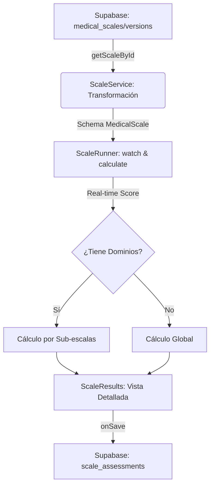

# 🏥 Arquitectura de Interpretación Clínica en Escalas

Este documento detalla cómo el sistema **ScaleForge** transforma las respuestas del usuario en puntuaciones numéricas e interpretaciones diagnósticas en tiempo real, garantizando precisión clínica y retroalimentación inmediata.

## 1. El Ciclo de Datos: Desde la DB al Navegador

El proceso comienza con la carga de la escala desde Supabase a través del `ScaleService`.

### Carga y Transformación (`api/scales/service.ts`)
Cuando se solicita una escala, el servicio realiza una integración de datos desde varias fuentes:

- **`medical_scales`**: Metadatos maestros (nombre, descripción, categoría).
- **`scale_versions`**: Contiene la "foto" actual de la escala, incluyendo preguntas (con sus opciones y puntajes) y la lógica de scoring completa.
- **`scale_questions` & `question_options`**: Utilizados como fallback si no hay una versión publicada.

**Mapeo Crítico**: El servicio transforma el formato de la base de datos al esquema `MedicalScale`. Durante este paso, se extrae la configuración de scoring que incluye:
- **Motor Global**: `engine` (suma o promedio).
- **RangosGlobales**: Umbrales que definen niveles de severidad (ej. 0-10 = Normal).
- **Dominios (Sub-escalas)**: Dimensiones independientes con su propio motor y rangos.

---

## 2. El Motor de Cálculo en Tiempo Real (`ScaleRunner.tsx`)

El componente `ScaleRunner` utiliza `react-hook-form` con el hook `watch()` para observar cambios en el formulario. Cada interacción dispara un recálculo reactivo.

### Lógica de Scoring Robusta
El sistema implementa defensas contra inconsistencias de tipos de datos, asegurando que comparaciones entre strings y números (comunes en integraciones de DB) no rompan el cálculo.

#### `calculateScore(engine, questions, answers)`
Es el corazón algorítmico del runner:
1. **Sumatoria (`sum`)**: Recorre las preguntas, busca la respuesta en el estado del formulario y extrae el valor numérico (`score`). Realiza comparaciones laxas (`==`) para manejar IDs que pueden venir como string o número.
2. **Promedio (`average`)**: Acumula puntos y divide por el número de preguntas efectivamente respondidas.
3. **Soporte de Tipos Mixtos**: Maneja respuestas tipo objeto (con prop `score`), números directos y strings numéricos.

#### `getInterpretation(score, ranges)`
Busca en la matriz de rangos el intervalo correspondiente al puntaje:
```typescript
ranges.find(r => numericScore >= r.min && numericScore <= r.max)
```
Si encuentra una coincidencia, devuelve el objeto de interpretación con:
- **Label**: Nombre del nivel (ej: "Disfunción Grave").
- **Interpretation**: Texto clínico descriptivo.
- **Color**: Código hexadecimal para feedback visual dinámico.

---

## 3. Soporte Multidominio (Sub-escalas)

El sistema soporta escalas complejas (como el Cuestionario de Boston) de forma jerárquica:

- **Definición de Dominios**: Cada dominio filtra las preguntas relevantes mediante `question_ids`.
- **Cálculo Independiente**: El sistema ejecuta `calculateScore` y `getInterpretation` por separado para el total global y cada dominio.
- **Renderizado Dinámico**: La interfaz detecta automáticamente si existen dominios y ajusta el footer para mostrar el desglose categórico.

---

## 4. Visualización e Interfaz de Usuario

- **Colores Semánticos**: Los estados se pintan dinámicamente (`results.globalInterpretation.color`).
- **Retroalimentación Inmediata**: Gracias al uso de `useMemo`, el médico recibe el diagnóstico clínico al instante mientras completa la escala.
- **Soporte de Fallbacks**: El componente `ScaleResults.tsx` incluye lógica de respaldo para asegurar que la interpretación se visualice incluso si la estructura de datos varía entre versiones.

---

## Flujo de Datos Arquitectónico


